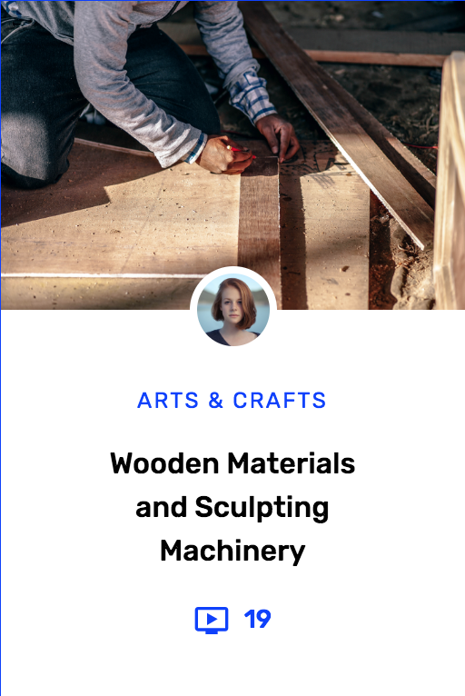
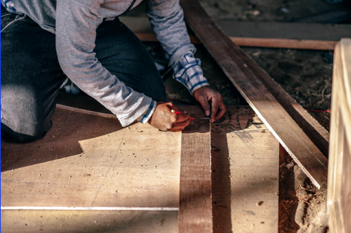
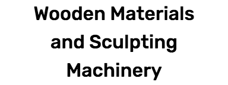
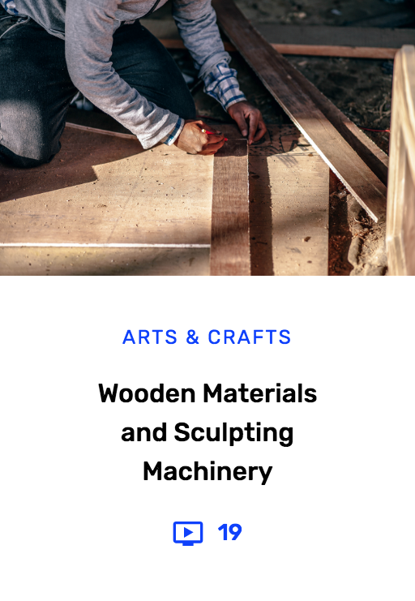
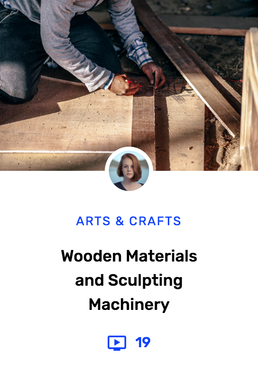

import { Image, Appear } from 'mdx-deck'
import { Invert, Split } from 'mdx-deck/layouts'
import { Flex, Box } from 'grid-styled'
export theme from './theme'
import BgBlue from './BgBlue'
import BrowserChrome from './BrowserChrome'

<!--
- What and Why of Functional CSS

- Tachyons Design System and how they map to CSS classnames
  - Typography
  - Spacing
  - Responsive modifiers
  - Layout
  - Theming

- Tachyons workflow with HTML (exercises)

- Tachyons + Components
  - Challenges with extending or making components configurable ([https://github.com/winkerVSbecks/tachyons-measured#why](https://github.com/winkerVSbecks/tachyons-measured#why))
  - Tachyons-Components
  - Angular + Tachyons

- Tools
  + Tachyons Generator
  + tldr
  + pesticide
  + https://github.com/dwyl/learn-tachyons
  + https://tachyons.pro
-->


import TachyonsLogo from './TachyonsLogo'

<div style={{textAlign: 'center'}}>
  <h4 style={{marginTop: '0', marginBottom: '2em', textTransform: 'uppercase', letterSpacing: '0.1em'}}>learning</h4>
  <TachyonsLogo style={{color: 'white', height: '8em', marginRight: '1em'}} />
</div>

---

## Learning Outcomes

1. Why & What of functional CSS?
1. The Tachyons design system & API
1. Building components with Tachyons

---

## 🛠 Pesticide

A chrome plugin for quickly debugging css layout issues by toggling different colored outlines on every element.

[pesticide.io](https://pesticide.io)

---

📦 Scoping (maintainability)

⏱️ Performance

🎨 Enforcing Design Language

---

<!-- <Image src="img/card-owl-ahero.png" size="75%" style={{backgroundPosition: 'left bottom', backgroundColor: '#fef582'}} /> -->

export default BgBlue

<Flex alignItems="center">
  <Box width={0.4}>
    
  </Box>
  <Box width={0.6} pl={5}>
    <h1>Course<br/>Card</h1>
  </Box>
</Flex>

---

export default BgBlue

<Flex mb={4} alignItems="flex-end">
  <Box mr={6} width={256} style={{textAlign: 'right'}}>Media</Box>
  
</Flex>

<Flex mb={4} alignItems="flex-end">
  <Box mr={6} width={256} style={{textAlign: 'right'}}>Avatar</Box>
  
</Flex>

<Flex mb={4} alignItems="flex-end">
  <Box mr={6} width={256} style={{textAlign: 'right'}}>Category</Box>
  
</Flex>

<Flex mb={4} alignItems="flex-end">
  <Box mr={6} width={256} style={{textAlign: 'right'}}>Title</Box>
  
</Flex>

<Flex alignItems="flex-end">
  <Box mr={6} width={256} style={{textAlign: 'right'}}>Count</Box>
  
</Flex>

---

# Scoped CSS

---

## BEM

```html
<div className="Card">
  <div className="Card__Media" />
  
  <h3 className="Card__Category">
    Arts & Crafts
  </h3>
  <h2 className="Card__Title">
    Wooden Materials and Sculpting Machinery
  </h2>
  <div className="Card__Count">22</div>
</div>
```

---

## CSS Modules
```jsx
import styles from './CourseCard.css';

const CourseCard = () => (
  <div className={styles.Card}>
    <div className={styles.Media} />
    
    <h3 className={styles.Category}>
      Arts & Crafts
    </h3>
    <h2 className={styles.Title}>
      Wooden Materials and Sculpting Machinery
    </h2>
    <div className={styles.Count}>22</div>
  </div>
);
```

---

## Componentized

```jsx
const CourseCard = () => (
  <Card>
    <Media />
    <Avatar />
    <Category>Arts & Crafts</Category>
    <Title>
      Wooden Materials and Sculpting Machinery
    </Title>
    <Count>22</Count>
  </Card>
);
```

---

export default Invert

<Image src="img/css-workflow.png" size="50%" />

---

# Challenges

🤷🏽‍ Have to write CSS to prototype new UI

📈 CSS always grows

🔁 Have to keep two abstractions in sync

😅 Scoping is purely convention based

---

# [The Evolution of<br/>CSS & UI Architecture](https://www.notion.so/rangle/The-Evolution-of-CSS-UI-Architecture-2291e1c572d0458ea6eac47a3071f686)

---

# Functional CSS

---

<Flex alignItems="stretch" style={{width: '100vw', height: '100vh'}}>
  <Box width={0.5} style={{backgroundImage: 'url("img/owltypescale.png")', backgroundSize: 'cover'}} />
  <Box width={0.5} style={{backgroundImage: 'url("img/owl-color-1.png")', backgroundSize: 'cover'}} />
</Flex>

---

export default Invert

<Image src="img/tachyons.io.png" size="50%" />

---

## Tachyons Classes

😇 Functional

🎹 Composable

💎 Immutable

---

<Image src="img/stats.jpg" size="50%" style={{backgroundColor: '#000'}} />

---

export default Invert

<Image src="img/tachyons-workflow.png" size="50%" />

---

<Flex alignItems="center">
  <BrowserChrome>
    
  </BrowserChrome>
  <Box ml={5}>
    <p style={{ fontSize: '0.75em', marginTop: 0 }}>Design systems are</p>
    <p style={{ marginBottom: 0 }}>Rules, Principles & Constraints<br/>Implemented In Design Code</p>
  </Box>
</Flex>

---

**[Typography](http://tachyons.io/docs/typography/scale)**<br/>
Font size, weight, style, line height & alignment

**[Layout](http://tachyons.io/docs/layout/spacing)**<br/>
Padding, margin, width, height, display & position

**[Skins](http://tachyons.io/docs/themes/skins/)**<br/>
Text, background & border color, opacity & hovers

---

## Responsive Modifiers

<Flex mt={5} flexWrap="wrap" style={{textAlign: 'center', fontSize: '2em', fontWeight: 900}}>
  <Box width={1} p={3} mb={3} bg="white" color="background">ns</Box>
  <Box flex="1 1 auto" mr={2} p={3} bg="white" color="background">m</Box>
  <Box flex="1 1 auto" ml={2} p={3} bg="white" color="background">l</Box>
</Flex>

---

# [tachyons-tldr.now.sh](https://tachyons-tldr.now.sh)

---

export default Split


### Exercise 1
[CodePen Template](https://codepen.io/winkerVSbecks/pen/QBoKpx?editors=1000)

---

<Image src="img/card-owl-type.png" size="cover" />

---

<Image src="img/bob-ross.gif" size="cover" />

---

export default Split



### Exercise 2
[CodePen Template](https://codepen.io/winkerVSbecks/pen/QBoKpx?editors=1000)

---

export default Split



### Exercise 3
[CodePen Template](https://codepen.io/winkerVSbecks/pen/QBoKpx?editors=1000)

---

###### 🛠️ TOOLS

Customize with<br/>
[tachyons-css/generator](https://github.com/tachyons-css/generator)

Extend with<br/>
[tachyons-tldr.now.sh/#/tools](https://tachyons-tldr.now.sh/#/tools)

---

Tachyons Design System Components

## Props 🔀 Design System ➡️ className

---

```jsx
const Title = props => (
  <h2
    className="rubik fw5 f5 black tc lh-copy ph3 mb3"
    {...props}
  />
);


const Category = props => (
  <h3
    className="rubik fw4 f7 ttu tracked blue tc mt0 mb3"
    {...props}
  />
);
```

---

```jsx
import styled from 'tachyons-components';


const Title = styled('h2')`
  rubik fw5 f5 black tc lh-copy ph3
`;


const Category = styled('h3')`
  rubik fw4 f7 ttu tracked blue tc mt0
`;
```

---

```jsx
<div>
  <Title mb3>Arts & Crafts</Title>

  <Category mb3>
    Wooden Materials and Sculpting Machinery
  </Category>
</div>
```

---

https://codepen.io/winkerVSbecks/pen/djNGbP?editors=0100
https://codepen.io/winkerVSbecks/pen/ZjXMZy
https://codepen.io/winkerVSbecks/pen/QBRNKZ?editors=1000

---

export default Split


### Exercise 4
[CodePen Template](https://codepen.io/winkerVSbecks/pen/QBoKpx?editors=1000)

---

# Angular

[msrd POC](https://github.com/rangle/msrd)

```html
<a class="br3"
  f="6" fw="3"
  ph="3" pv="2" mb="2"
  clr="white" bg="purple"
  href="#0">
  Button Text
</a>
```

---

### Thanks!

[github.com/rangle/tachyons-workshop](https://github.com/rangle/tachyons-workshop)
